# Consultas SQL de MoviCab

## Introducción

Este informe reúne consultas realizadas sobre la base de datos de MoviCab en MySQL, PostgreSQL y Oracle. Para facilitar la comparación, ambos motores presentan los mismos tipos de consulta y siguen una estructura común: pregunta, consulta SQL y evidencia.

## MySQL

### 1. Búsqueda con LIKE

**Pregunta:** ¿Cuáles son los pasajeros cuyo nombre contiene la palabra "Luis"?

**Consulta SQL:**

```sql
SELECT
    id,
    nombre,
    descripcion
FROM pasajero
WHERE nombre LIKE '%Luis%';
```

**Resultado observado:** La consulta identifica los pasajeros cuyo nombre contiene "Luis". En los datos registrados en MoviCab, el resultado corresponde al pasajero Luis Gomez, registrado como cliente frecuente.

**Evidencia:**

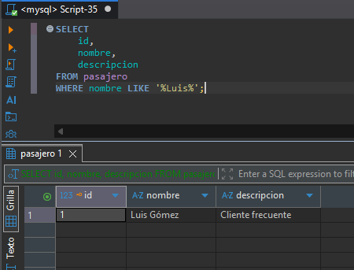

### 2. Subconsulta

**Pregunta:** ¿Qué pasajeros han realizado carreras cuyo valor total es superior a $20.000 y cuál es el valor de esas carreras?

**Consulta SQL:**

```sql
SELECT
    p.id,
    p.nombre AS pasajero,
    c.total AS valor_carrera
FROM pasajero p
INNER JOIN carrera c
    ON p.id = c.pasajero_id
WHERE c.id IN (
    SELECT id
    FROM carrera
    WHERE total > 20000
)
ORDER BY c.total DESC;
```

**Evidencia:**

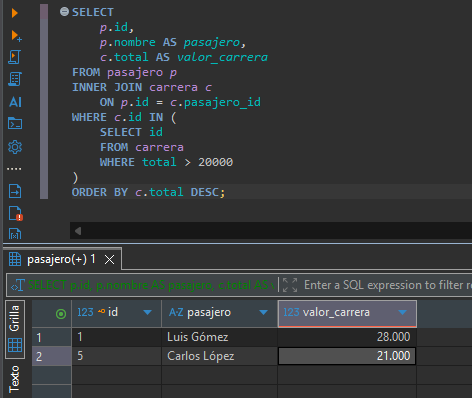

### 3. Agrupamiento con GROUP BY

**Pregunta:** ¿Cuántas carreras ha realizado cada pasajero y cuántas tiene registradas en MoviCab?

La consulta muestra cada pasajero junto con su cantidad de carreras registradas.

**Consulta SQL:**

```sql
SELECT
    p.id,
    p.nombre AS pasajero,
    COUNT(c.id) AS cantidad_carreras
FROM pasajero p
LEFT JOIN carrera c
    ON p.id = c.pasajero_id
GROUP BY
    p.id,
    p.nombre
ORDER BY
    cantidad_carreras DESC;
```

**Evidencia:**

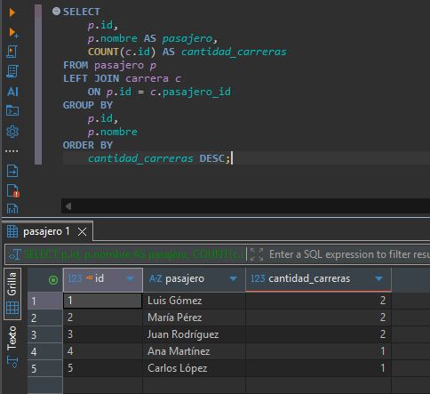

### 4. Filtro de grupos con HAVING

**Pregunta:** ¿Qué pasajeros han realizado más de una carrera en MoviCab?

La consulta agrupa las carreras por pasajero y después filtra los grupos con más de una carrera mediante `HAVING`.

**Consulta SQL:**

```sql
SELECT
    p.id,
    p.nombre AS pasajero,
    COUNT(c.id) AS cantidad_carreras
FROM pasajero p
INNER JOIN carrera c
    ON p.id = c.pasajero_id
GROUP BY
    p.id,
    p.nombre
HAVING COUNT(c.id) > 1
ORDER BY cantidad_carreras DESC;
```

**Evidencia:**

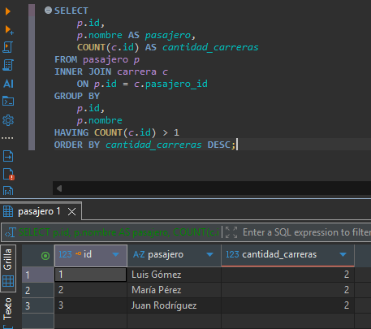

### 5. Ordenamiento con ORDER BY

**Pregunta:** ¿Cuáles son las carreras de MoviCab, ordenadas de mayor a menor según su valor total?

La consulta muestra la carrera, el pasajero, el valor y el estado, ordenados por valor descendente.

**Consulta SQL:**

```sql
SELECT
    c.id AS carrera,
    p.nombre AS pasajero,
    c.total AS valor_carrera,
    c.estado
FROM carrera c
INNER JOIN pasajero p
    ON c.pasajero_id = p.id
ORDER BY c.total DESC;
```

**Evidencia:**

.png>)

### 6. Relación de tablas con JOIN

**Pregunta:** ¿Qué pasajero realizó cada carrera, qué conductor la atendió, qué vehículo utilizó y a qué empresa pertenece ese vehículo?

La consulta relaciona las tablas de carreras, pasajeros, turnos, conductores, vehículos y empresas.

**Consulta SQL:**

```sql
SELECT
    c.id AS carrera,
    p.nombre AS pasajero,
    co.nombre AS conductor,
    v.nombre AS vehiculo,
    e.razon_social AS empresa
FROM carrera c
INNER JOIN pasajero p
    ON c.pasajero_id = p.id
INNER JOIN turno t
    ON c.turno_id = t.id
INNER JOIN conductor co
    ON t.conductor_id = co.id
INNER JOIN vehiculo v
    ON t.vehiculo_id = v.id
INNER JOIN empresa e
    ON v.empresa_id = e.id
ORDER BY c.id;
```

**Evidencia:**

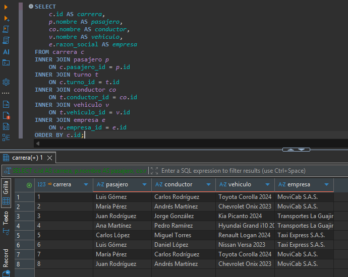

### 7. Filtro con WHERE

**Pregunta:** ¿Cuáles son las carreras cuyo valor total es superior a $15.000 y cuál es su estado?

La consulta filtra las carreras cuyo valor supera $15.000.

**Consulta SQL:**

```sql
SELECT
    c.id AS carrera,
    p.nombre AS pasajero,
    c.total AS valor_carrera,
    c.estado
FROM carrera c
INNER JOIN pasajero p
    ON c.pasajero_id = p.id
WHERE c.total > 15000
ORDER BY c.total DESC;
```

**Evidencia:**

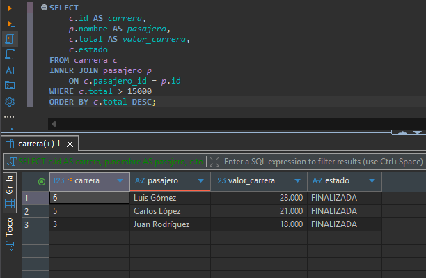

## PostgreSQL

### 1. Búsqueda con LIKE

**Pregunta:** ¿Cuáles son los pasajeros cuyo nombre contiene la palabra "Luis"?

**Consulta SQL:**

```sql
SELECT
    id,
    nombre,
    descripcion
FROM pasajero
WHERE nombre LIKE '%Luis%';
```

**Evidencia:**

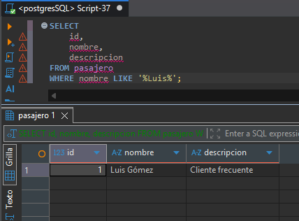

### 2. Subconsulta

**Pregunta:** ¿Qué pasajeros han realizado carreras cuyo valor total es superior a $20.000 y cuál es el valor de esas carreras?

**Consulta SQL:**

```sql
SELECT
    p.id,
    p.nombre AS pasajero,
    c.total AS valor_carrera
FROM pasajero p
INNER JOIN carrera c
    ON p.id = c.pasajero_id
WHERE c.id IN (
    SELECT id
    FROM carrera
    WHERE total > 20000
)
ORDER BY c.total DESC;
```

**Evidencia:**


### 3. Agrupamiento con GROUP BY

**Pregunta:** ¿Cuántas carreras ha realizado cada pasajero en MoviCab?

**Consulta SQL:**

```sql
SELECT
    p.id,
    p.nombre AS pasajero,
    COUNT(c.id) AS cantidad_carreras
FROM pasajero p
LEFT JOIN carrera c
    ON p.id = c.pasajero_id
GROUP BY
    p.id,
    p.nombre
ORDER BY
    cantidad_carreras DESC;
```

**Evidencia:**


### 4. Filtro de grupos con HAVING

**Pregunta:** ¿Qué pasajeros han realizado más de una carrera en MoviCab y cuántas carreras ha realizado cada uno?

**Consulta SQL:**

```sql
SELECT
    p.id,
    p.nombre AS pasajero,
    COUNT(c.id) AS cantidad_carreras
FROM pasajero p
INNER JOIN carrera c
    ON p.id = c.pasajero_id
GROUP BY
    p.id,
    p.nombre
HAVING COUNT(c.id) > 1
ORDER BY
    cantidad_carreras DESC;
```

**Evidencia:**


### 5. Ordenamiento con ORDER BY

**Pregunta:** ¿Cuáles son las carreras de MoviCab, ordenadas de mayor a menor según su valor total?

**Consulta SQL:**

```sql
SELECT
    c.id AS carrera,
    p.nombre AS pasajero,
    c.total AS valor_carrera,
    c.estado
FROM carrera c
INNER JOIN pasajero p
    ON c.pasajero_id = p.id
ORDER BY c.total DESC;
```

**Evidencia:**


### 6. Relación de tablas con JOIN

**Pregunta:** ¿Qué pasajero realizó cada carrera, qué conductor la atendió, qué vehículo utilizó y a qué empresa pertenece ese vehículo?

**Consulta SQL:**

```sql
SELECT
    c.id AS carrera,
    p.nombre AS pasajero,
    co.nombre AS conductor,
    v.nombre AS vehiculo,
    e.razon_social AS empresa
FROM carrera c
INNER JOIN pasajero p
    ON c.pasajero_id = p.id
INNER JOIN turno t
    ON c.turno_id = t.id
INNER JOIN conductor co
    ON t.conductor_id = co.id
INNER JOIN vehiculo v
    ON t.vehiculo_id = v.id
INNER JOIN empresa e
    ON v.empresa_id = e.id
ORDER BY c.id;
```

**Evidencia:**


### 7. Filtro con WHERE

**Pregunta:** ¿Cuáles son las carreras cuyo valor total es superior a $15.000 y cuál es su estado?

**Consulta SQL:**

```sql
SELECT
    c.id AS carrera,
    p.nombre AS pasajero,
    c.total AS valor_carrera,
    c.estado
FROM carrera c
INNER JOIN pasajero p
    ON c.pasajero_id = p.id
WHERE c.total > 15000
ORDER BY c.total DESC;
```

**Evidencia:** 

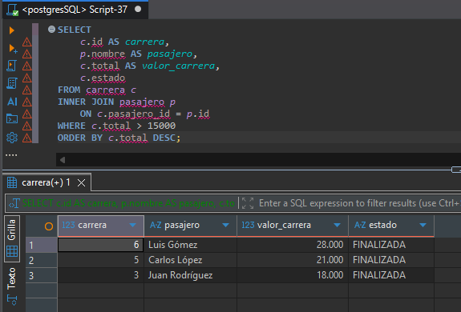

## SQL-Server

### 1. Búsqueda con LIKE

**Pregunta:** ¿Cuáles son los pasajeros cuyo nombre contiene la palabra "Luis"?

**Consulta SQL:**

```sql
SELECT
id,
nombre,
descripcion
FROM pasajero
WHERE nombre LIKE '%Luis%';
```

**Evidencia:**

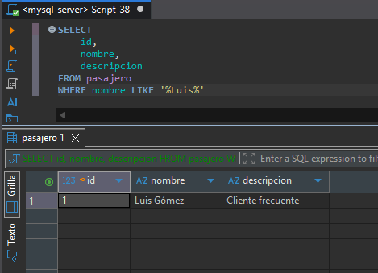

### 2. Subconsulta

**Pregunta:** ¿Qué pasajeros han realizado carreras cuyo valor total es superior a $20.000 y cuál es el valor de esas carreras?

**Consulta SQL:**

```sql
SELECT
p.id,
p.nombre AS pasajero,
c.total AS valor_carrera
FROM pasajero p
INNER JOIN carrera c
ON p.id = c.pasajero_id
WHERE c.id IN (
SELECT id
FROM carrera
WHERE total > 20000
)
ORDER BY c.total DESC;
```

**Evidencia:**

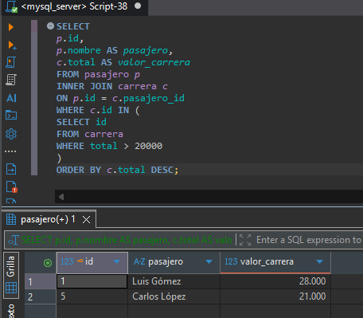

### 3. Agrupamiento con GROUP BY

**Pregunta:** ¿Cuántas carreras ha realizado cada pasajero en MoviCab?

**Consulta SQL:**

```sql
SELECT
p.id,
p.nombre AS pasajero,
COUNT(c.id) AS cantidad_carreras
FROM pasajero p
LEFT JOIN carrera c
ON p.id = c.pasajero_id
GROUP BY
p.id,
p.nombre
ORDER BY
cantidad_carreras DESC;
```

**Evidencia:**

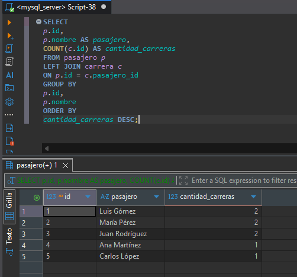

### 4. Filtro de grupos con HAVING

**Pregunta:** ¿Qué pasajeros han realizado más de una carrera en MoviCab y cuántas carreras ha realizado cada uno?

**Consulta SQL:**

```sql
SELECT
p.id,
p.nombre AS pasajero,
COUNT(c.id) AS cantidad_carreras
FROM pasajero p
INNER JOIN carrera c
ON p.id = c.pasajero_id
GROUP BY
p.id,
p.nombre
HAVING COUNT(c.id) > 1
ORDER BY
cantidad_carreras DESC;
```

**Evidencia:**

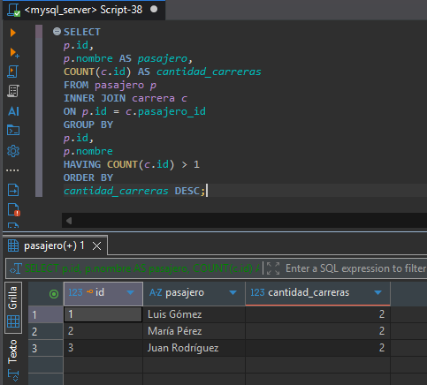

### 5. Ordenamiento con ORDER BY

**Pregunta:** ¿Cuáles son las carreras de MoviCab, ordenadas de mayor a menor según su valor total?

**Consulta SQL:**

```sql
SELECT
c.id AS carrera,
p.nombre AS pasajero,
c.total AS valor_carrera,
c.estado
FROM carrera c
INNER JOIN pasajero p
ON c.pasajero_id = p.id
ORDER BY c.total DESC;
```

**Evidencia:**

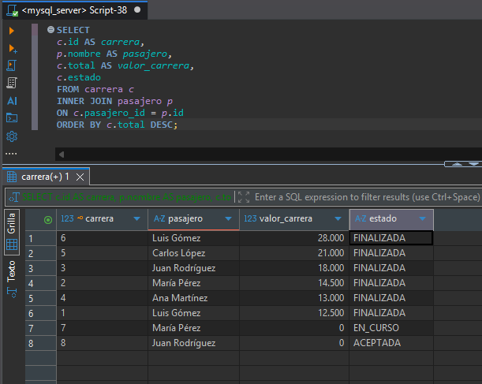

### 6. Relación de tablas con JOIN

**Pregunta:** ¿Qué pasajero realizó cada carrera, qué conductor la atendió, qué vehículo utilizó y a qué empresa pertenece ese vehículo?

**Consulta SQL:**

```sql
SELECT
c.id AS carrera,
p.nombre AS pasajero,
co.nombre AS conductor,
v.nombre AS vehiculo,
e.razon_social AS empresa
FROM carrera c
INNER JOIN pasajero p
ON c.pasajero_id = p.id
INNER JOIN turno t
ON c.turno_id = t.id
INNER JOIN conductor co
ON t.conductor_id = co.id
INNER JOIN vehiculo v
ON t.vehiculo_id = v.id
INNER JOIN empresa e
ON v.empresa_id = e.id
ORDER BY c.id;
```

**Evidencia:**

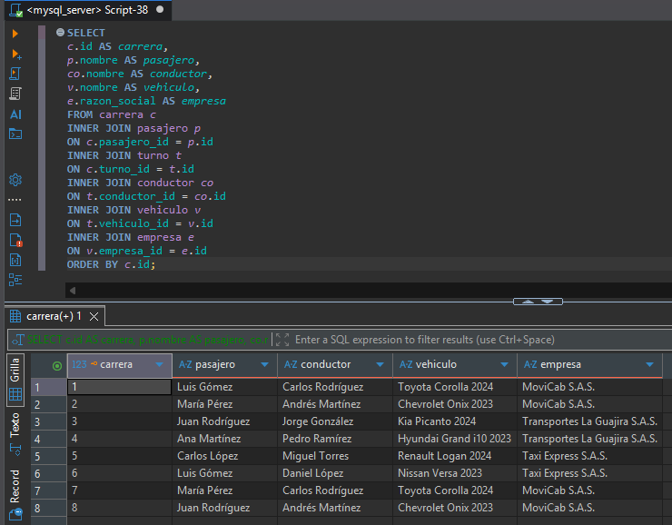

### 7. Filtro con WHERE

**Pregunta:** ¿Cuáles son las carreras cuyo valor total es superior a $15.000 y cuál es su estado?

**Consulta SQL:**

```sql
SELECT
c.id AS carrera,
p.nombre AS pasajero,
c.total AS valor_carrera,
c.estado
FROM carrera c
INNER JOIN pasajero p
ON c.pasajero_id = p.id
WHERE c.total > 15000
ORDER BY c.total DESC;
```

**Evidencia:**

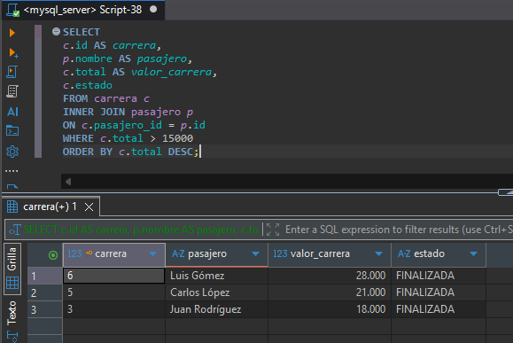


## Oracle

### 1. Búsqueda con LIKE

**Pregunta:** ¿Cuáles son los pasajeros cuyo nombre contiene la palabra "Luis"?

**Consulta SQL:**

```sql
SELECT
id,
nombre,
descripcion
FROM pasajero
WHERE nombre LIKE '%Luis%';
```
**Evidencia:**
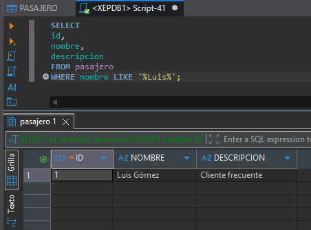


### 2. Subconsulta

**Pregunta:** ¿Qué pasajeros han realizado carreras cuyo valor total es superior a $20.000 y cuál es el valor de esas carreras?

**Consulta SQL:**

```sql
SELECT
p.id,
p.nombre AS pasajero,
c.total AS valor_carrera
FROM pasajero p
INNER JOIN carrera c
ON p.id = c.pasajero_id
WHERE c.id IN (
SELECT id
FROM carrera
WHERE total > 20000
)
ORDER BY c.total DESC;
```

**Evidencia:**
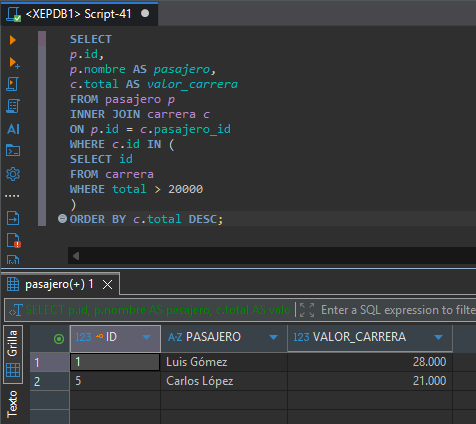

### 3. Agrupamiento con GROUP BY

**Pregunta:** ¿Cuántas carreras ha realizado cada pasajero en MoviCab?

**Consulta SQL:**

```sql
SELECT
p.id,
p.nombre AS pasajero,
COUNT(c.id) AS cantidad_carreras
FROM pasajero p
LEFT JOIN carrera c
ON p.id = c.pasajero_id
GROUP BY
p.id,
p.nombre
ORDER BY
cantidad_carreras DESC;
```

**Evidencia:**
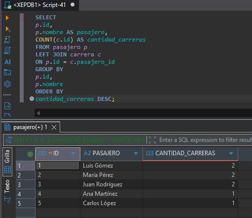


### 4. Filtro de grupos con HAVING

**Pregunta:** ¿Qué pasajeros han realizado más de una carrera en MoviCab y cuántas carreras ha realizado cada uno?

**Consulta SQL:**

```sql
SELECT
p.id,
p.nombre AS pasajero,
COUNT(c.id) AS cantidad_carreras
FROM pasajero p
INNER JOIN carrera c
ON p.id = c.pasajero_id
GROUP BY
p.id,
p.nombre
HAVING COUNT(c.id) > 1
ORDER BY
cantidad_carreras DESC;
```

**Evidencia:**
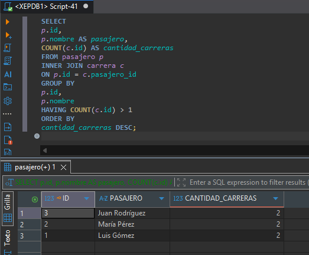


### 5. Ordenamiento con ORDER BY

**Pregunta:** ¿Cuáles son las carreras de MoviCab, ordenadas de mayor a menor según su valor total?

**Consulta SQL:**

```sql
SELECT
c.id AS carrera,
p.nombre AS pasajero,
c.total AS valor_carrera,
c.estado
FROM carrera c
INNER JOIN pasajero p
ON c.pasajero_id = p.id
ORDER BY c.total DESC;
```

**Evidencia:**
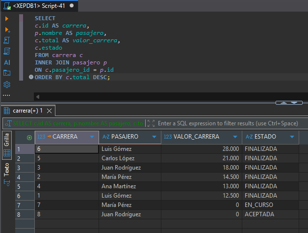


### 6. Relación de tablas con JOIN

**Pregunta:** ¿Qué pasajero realizó cada carrera, qué conductor la atendió, qué vehículo utilizó y a qué empresa pertenece ese vehículo?

**Consulta SQL:**

```sql
SELECT
c.id AS carrera,
p.nombre AS pasajero,
co.nombre AS conductor,
v.nombre AS vehiculo,
e.razon_social AS empresa
FROM carrera c
INNER JOIN pasajero p
ON c.pasajero_id = p.id
INNER JOIN turno t
ON c.turno_id = t.id
INNER JOIN conductor co
ON t.conductor_id = co.id
INNER JOIN vehiculo v
ON t.vehiculo_id = v.id
INNER JOIN empresa e
ON v.empresa_id = e.id
ORDER BY c.id;
```

**Evidencia:**
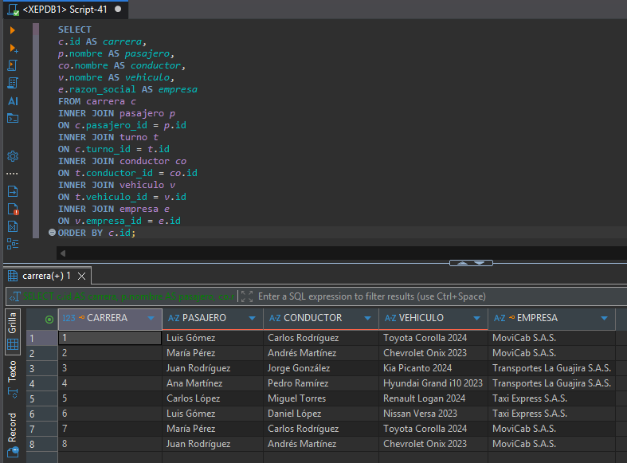


### 7. Filtro con WHERE

**Pregunta:** ¿Cuáles son las carreras cuyo valor total es superior a $15.000 y cuál es su estado?

**Consulta SQL:**

```sql
SELECT
c.id AS carrera,
p.nombre AS pasajero,
c.total AS valor_carrera,
c.estado
FROM carrera c
INNER JOIN pasajero p
ON c.pasajero_id = p.id
WHERE c.total > 15000
ORDER BY c.total DESC;
```
**Evidencia:**
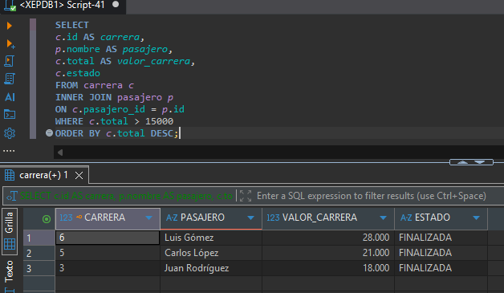